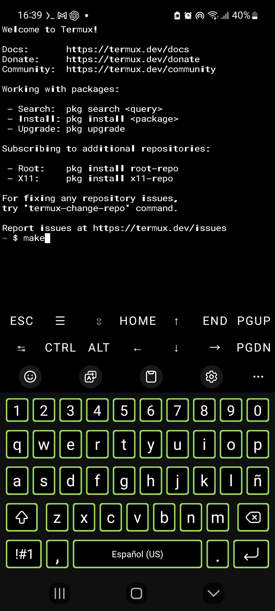

# WRT (Web Request Tool)

WRT es una herramienta de prueba de carga HTTP(S) escrita en C diseñada para funcionar en Termux y sistemas Linux.  
Está orientada a realizar pruebas de rendimiento y estrés de servidores web, incluyendo soporte para conexiones HTTP, HTTPS y RTMP.

---

## Instalación

### Clonar repositorio desde GitHub

```git clone https://github.com/lavacraft239/Wrt.git```
```cd Wrt```

---

# Instalación con dpkg

En termux:
dpkg -i wrt-deb.deb

En linux:
sudo dpkg -i wrt-deb.deb

---
# Como instalar los paquetes

se instala con (para termux):

```pkg install curl```
```pkg install libcurl```

y en Linux

```sudo apt update && sudo apt install curl git build-essential -y```

---

# Como compilar

se compila con ```*make*```

 ejemplo:
 
 
---

# Como utilizar wrt

se utilisa con el comando con

Con el https
```./wrt https://ejemplo.com -r 10 -p 100 -t 30 -w 10 -c 5 --insecure```

Con el http

```./wrt http://ejemplo.com -r 10 -p 100 -t 30 -w 10 -c 5```

Con el rtmp

```./wrt rtmp://localhost/live/ejemplo -r 10 -p 100 -t 30 -w 10 -c 5```

---

# Mensaje

Wrt es el 4 lugar el mejor programa de ataque para teléfonos.

---

## Licencia

WRT es un proyecto de código abierto bajo la licencia MIT.  
Ver el archivo [LICENSE](LICENSE) para más detalles.

---

Y recuerda que es un herramienta de benchmarg

---

El Logo de WRT

---

Para utilizar sin ./ puede hacer ```source ~/.bashrc``` y después puedes utilizar sin ./ por ejemplo wrt https://ejemplo.com -r 10 -p 100 -t 30 -w 10 -c 5 --insecure

---

Muchas gracias por leer y cierto soy Santiago Adios🤗.
